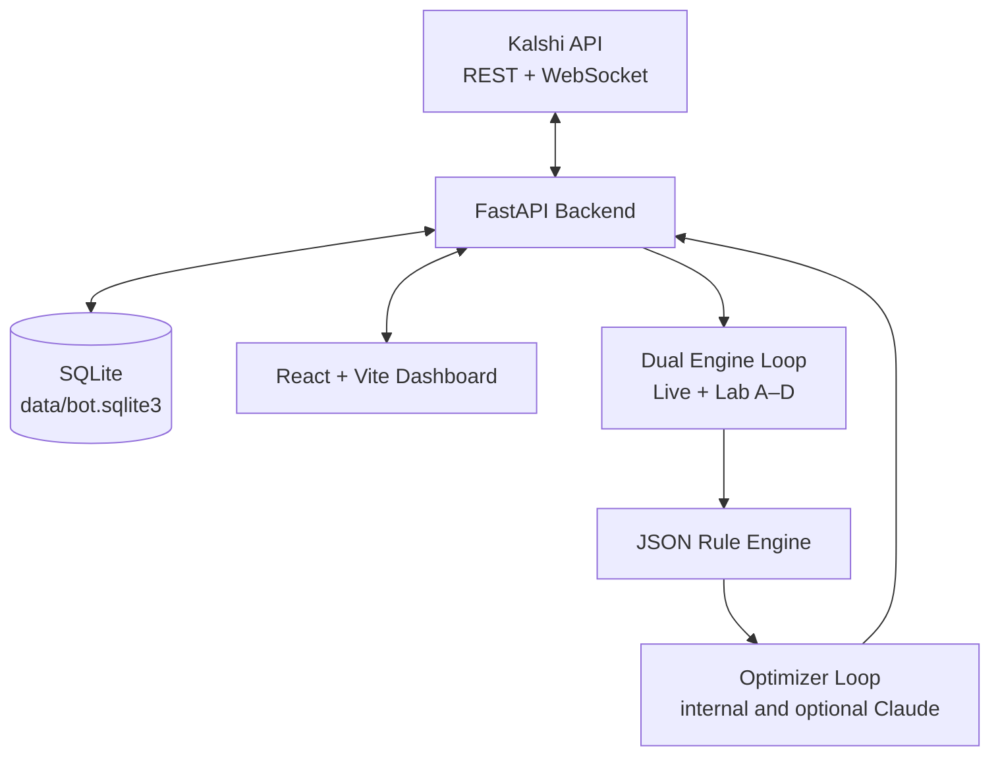
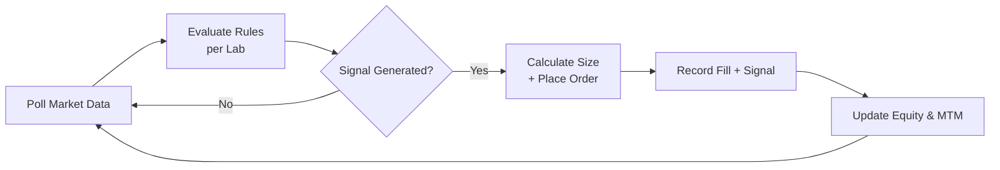
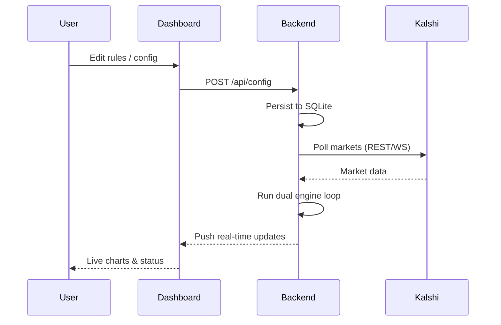

# Kalshibot

**Self-hosted Kalshi trading stack** — FastAPI + React.

Polls Kalshi markets in real time, matches **JSON probability + time-based rules**, executes trades across **Live + four paper labs (A–D)** in parallel, records every fill and signal in **SQLite**, and includes an optional intelligent **optimizer loop** (internal tuning + optional Claude assistance) that only auto-persists safe changes to **Lab A**.

---

## Features

- Real-time market data via Kalshi REST + WebSocket
- Flexible JSON-configurable trading rules per lab
- **Live trading** + **four independent paper labs** (A, B, C, D)
- Full trade history, signals, and equity snapshots in SQLite
- Modern real-time React dashboard with charts, holdings, signals, and health monitoring
- Optional optimizer loop with internal auto-tuning and Claude integration (guardrails protect Live and non-A labs)
- Structured logging, health endpoints, and config versioning
- Easy deployment: Windows .exe, Docker, or Python source
- Full test suite + GitHub Actions CI

**Current Version:** `v0.4.15.009` (see [`VERSION`](VERSION) and [`CHANGELOG.md`](CHANGELOG.md))

---

## Architecture

## Dual Engine Loop Flow

## Operator Flow (High-Level)

## Quick Start (Windows – Recommended)

1. Download the latest Windows executable from Releases (or build via `pyinstaller kalshibot-api.spec`)
2. Run `kalshibot.exe`
3. Open `http://localhost:8770` in your browser

macOS / Linux / Docker -> see full instructions in the `docs/` folder.

## Dashboard Overview

The single-page React dashboard gives you:

- Branch performance comparison (Live + Lab A–D)
- Real-time equity curves and mark-to-market (MTM)
- Current holdings and open positions
- Active signals and rule-match history
- Optimizer status and tuning radar
- Live JSON config editor with history
- Health orbs and system status

## Configuration

Everything is driven by versioned JSON configs:

- Per-lab trading rules
- Sizing logic, risk parameters, fee models
- Optimizer settings
- Kalshi API credentials (stored locally only)

Configs are audited and versioned in the database for easy rollback.

## Runbooks & Documentation

- Quick Start - Windows
- macOS / Linux Setup
- Configuration Guide
- API Reference
- Optimizer Deep Dive
- Production Readiness & Limitations

## Production Notes & Limitations

- Self-hosted only — your keys and data never leave your machine
- No built-in multi-user authentication (secure your host with firewall/VPN)
- Regular backups of `data/bot.sqlite3` are strongly recommended
- Monitor structured logs and the `/api/health` endpoint

## Tech Stack

- Backend: Python 3, FastAPI, SQLModel, httpx, structlog
- Frontend: React + TypeScript, Vite, Recharts
- Database: SQLite
- Deployment: PyInstaller, Docker
- Testing: pytest + GitHub Actions

## Developer Notes

- Primary development happens on the `develop` branch
- Frontend supports hot reload during development
- Backend requires restart when changing engine or persistence code
- Pre-commit hooks, Ruff, and type checking are enforced

Questions or contributions? Open an issue or PR on `develop`.
Happy trading! 🚀
