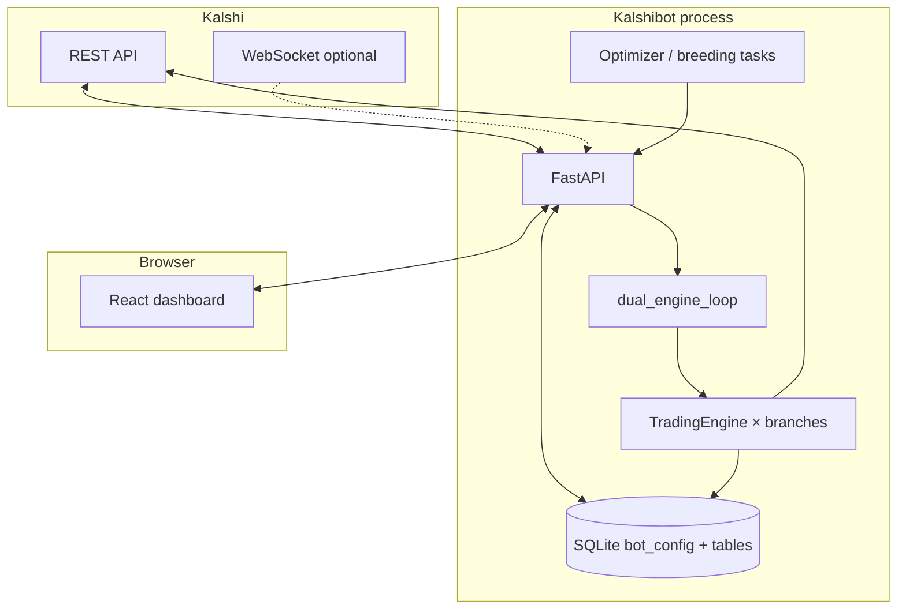

# Kalshibot (“Chomp’s Diner”)

**Self-hosted Kalshi trading stack** — a **FastAPI** backend and **React (Vite)** dashboard on **your** machine. **Labs Breeding** is the strategic loop: breeder parents (**Labs B–E**) drive a **genetic tournament** of hidden **`lab_child_*`** engines (replay fitness, pool vs death chamber, gated **adoption into Lab A**). **Lab A** is staging only; **Live** changes only when you explicitly promote. A **dual loop** ticks **Live + Lab A–E + children** against Kalshi **REST/WebSocket**; **SQLite** holds config and history; an **optimizer** proposes bounded experiments. The **Breeding Council Think Tank** (Labs **B–E**) is **cosmetic UI dialogue** (`GET /labs/chat`) — **not** the GA (see [`lab_breeding.py`](backend/app/lab_breeding.py)).

| | |
|---|---|
| **Version** | [`VERSION`](VERSION) · history in [`CHANGELOG.md`](CHANGELOG.md) |
| **Default branches** | **`develop`** — day-to-day · **`main`** — release / sidecar worktrees |
| **Primary data** | `data/bot.sqlite3` · optional JSONL under `data/logs/` |
| **Stack** | Python 3.11+ · FastAPI · React 18 · TypeScript · Vite · Recharts |

> **Safety (read once)**  
> **Only Lab A** is on the intentional path toward Live, with confirmations and gates. **Real-money** paths stay behind explicit acks and `simulate` / `live_paper_trading` settings — never strip those checks. **Back up** `data/bot.sqlite3` before destructive resets. Kalshibot is **not affiliated with Kalshi**; trading involves risk.

---

## Run it (TL;DR)

**Windows (happy path)** — from repo root in **PowerShell**:

```powershell
.\scripts\create_venv.ps1
Copy-Item .env.example .env   # then edit: Kalshi keys, KALSHI_ENV, ports
.\scripts\launch_local.ps1     # API + Vite; see script for -SkipMainSidecar / main sidecar
```

Open **`http://127.0.0.1:5174`** (develop Vite). API default **`http://127.0.0.1:8765`** · OpenAPI **`/docs`** on that host.

**macOS / Linux** — same idea, two terminals from repo root:

```bash
python3 -m venv .venv && source .venv/bin/activate   # Windows: .venv\Scripts\activate
pip install -U pip && pip install -r requirements.txt
cp .env.example .env && ${EDITOR:-vi} .env
python -m uvicorn backend.app.main:app --reload --host 127.0.0.1 --port 8765
```

Second terminal: `cd frontend && npm ci && npm run dev` — put your Vite origin in **`CORS_ORIGINS`** in `.env` and restart the API.

---

## Table of contents

1. [Run it (TL;DR)](#run-it-tldr)
2. [Why run Kalshibot](#why-run-kalshibot)
3. [What you get out of the box](#what-you-get-out-of-the-box)
4. [Labs Breeding (the closed loop)](#labs-breeding-the-closed-loop)
5. [Operator playbook](#operator-playbook)
6. [Architecture](#architecture)
7. [Branch model (Live + labs)](#branch-model-live--labs)
8. [Prerequisites](#prerequisites)
9. [Quick start — Windows (recommended path)](#quick-start--windows-recommended-path)
10. [Quick start — macOS / Linux](#quick-start--macos--linux)
11. [Packaged API (Windows exe)](#packaged-api-windows-exe)
12. [Configuration: two layers](#configuration-two-layers)
13. [Dashboard & Settings map](#dashboard--settings-map)
14. [Equity curves (deep dive)](#equity-curves-deep-dive)
15. [API reference](#api-reference)
16. [Development & testing](#development--testing)
17. [Upgrading & parallel checkouts](#upgrading--parallel-checkouts)
18. [Troubleshooting](#troubleshooting)
19. [Security & operations](#security--operations)
20. [Repository layout](#repository-layout)
21. [Contributing](#contributing)
22. [Glossary](#glossary)
23. [Further reading](#further-reading)

---

## Why run Kalshibot

- **Single glass pane** — Live (paper or real), **Lab A**, **Labs B–E** breeders, **`lab_child_*`** slots, Optimizer **Breeder / Tree**, equity, MTM, signals, trades, open sims, personality radar, lineage.

- **Rules stay on your disk** — JSON merged in SQLite; per-lab overlays; **config_history** on successful saves.

- **Observable by design** — structlog, health routes, snapshots, optional JSONL, **`/docs`** OpenAPI.

- **No SaaS in the middle** — keys and DB stay on hardware you control.

---

## What you get out of the box

| Area | Details |
|------|---------|
| **Engines** | `dual_engine_loop` ticks Live + Lab A–E + children with **stagger** to reduce Kalshi API burst. |
| **Paper sim** | Per-branch bankroll, fees, patient stop-loss, swing exits, windowed budget caps, one-open-per-series guards in SQLite. |
| **Labs Breeding** | Parents **B–E** → **`lab_child_*`** GA → pool / death chamber → gated **adoption → Lab A**. Not the Think Tank. |
| **Optimizer** | Internal pulse (default); optional Claude path. Telemetry via **`GET /api/optimizer/status`**. |
| **Think Tank** | Ephemeral dialogue via `GET /labs/chat`; **no** per-message server log unless **`LAB_THINK_TANK_LOG_INFO=1`**. |
| **Audit** | **`config_history`** stores full JSON snapshots on successful config writes. |

---

## Labs Breeding (the closed loop)

Breeding answers: **which simulated strategies deserve to move toward Live**, without auto-promoting real money.

| Stage | What happens |
|-------|----------------|
| **1. Parents** | **Labs B–E** run full paper ticks with distinct rules/sizing; behavior and settled history feed scoring. |
| **2. Children** | Up to six **`lab_child_*`** branches hold candidate configs (crossover / mutation); they tick in the dual loop and accumulate **fitness** (see [`lab_breeding.py`](backend/app/lab_breeding.py)). |
| **3. Pressure** | Weak lines hit the **death chamber**; survivors stay in the **pool** (Tree tab + optimizer status). |
| **4. Adoption → Lab A** | **Gated** promotion of a child’s traits into **Lab A** (still not Live). |
| **5. Lab A → Live** | Explicit operator flow with confirmations — see [operating contract](.cursor/rules/kalshibot-operating-contract.mdc). |

**Where to see it:** Dashboard **Optimizer** → **Breeder** (12-axis radar) and **Tree** (lineage, pool, culls). The **Breeding: …** strip under the Optimizer title is live telemetry.

**Think Tank is not breeding** — B–E chat lines are **flavor** for the UI; disabling or ignoring them does **not** stop the GA.

---

## Operator playbook

| Goal | What to do |
|------|------------|
| **Paper everything first** | Keep **`simulate`** / **`live_paper_trading`** in paper-friendly modes; use Live branch in paper until you deliberately switch. |
| **Turn several lab engines on at once** | **Settings → Simulation labs → Mass apply** — engines ON for selected labs; persists via **`PUT /api/config/lab-branches`**. |
| **One lab (e.g. E) won’t stay on after refresh** | Same **`PUT /api/config/lab-branches`** path (avoid legacy toggle-only flows on old builds). |
| **Copy sizing / patient stop across labs** | Mass apply: copy sizing from active tab; copy patient stop from a chosen source lab. |
| **Restore distinct B–E templates** | **Settings → Simulation labs → Breeder labs (B–E)** → **Reset to smart defaults** per lab — pulls **`GET /api/config/breeder-smart-defaults/{lab_b…lab_e}`** (rules + sizing + council weight + personality + patient-stop defaults + optimizer floors). |
| **Force mutation vs diversify council** | **Settings → Optimizer:** **Force internal mutation** runs one **Lab A** optimizer cycle + replay gate (does not retune B–E council math). **Diversify council** applies a **B–E** pulse and sets **`labs_council_diversity_until`** (~45m) for stronger council tilt on breeder effective YES. |
| **Inspect config the API sees** | **`GET /api/config`** and **`GET /api/dashboard`**; writes use **`PUT /api/config`** or lab-branch merge routes. |
| **Two browser tabs (5174 vs 5175)** | Default **:5174** = develop pill; **:5175** = **test** pill (see [`frontend/src/uiTrack.ts`](frontend/src/uiTrack.ts)). Same data if both proxy the same API — change **`frontend/.env`** `VITE_API_ORIGIN` for a second stack. |
| **Quiet Think Tank structlog** | Leave **`LAB_THINK_TANK_LOG_INFO`** unset or `0`. |
| **Cold start / dashboard latency** | See [`docs/startup_performance.md`](docs/startup_performance.md). |
---

## Architecture



**Pointers**

- **`backend/app/main.py`** — Routes, dashboard assembly, engine toggles, **`PUT /api/config/lab-branches`**.  

- **`backend/app/engines/`** — `tick_once`, sim flow, equity snapshots, think-tank hooks.  

- **`backend/app/persistence.py`** — `Store`, migrations, **`config_history`**.  

- **`backend/app/branch_config.py`** — Merged effective config per branch.  

- **`backend/app/lab_breeding.py`** — GA / children / adoption gates.  

- **`backend/app/lab_communication.py`** — Think Tank bus.  

- **`frontend/src/App.tsx`** — Shell, polling, lab toggles.

---

## Branch model (Live + labs)

| Branch key | UI / product role | Breeding role |
|------------|-------------------|---------------|
| **`live`** | Production path: **paper** or **real** per `simulate` / `live_paper_trading`. | N/A |
| **`lab_a`** | Staging; optimizer nudges + **child adoption** target. | **Destination** for adopted configs before Live. |
| **`lab_b`** … **`lab_e`** | Distinct paper personalities. | **Parents** — GA diversity. |
| **`lab_child_*`** | Hidden tournament slots in the dual loop. | **Candidates** — mutation / crossover / fitness / cull / adopt. |

Legacy **`sim_lab`** in SQLite is treated as **Lab A** for rollups and charts.

---

## Prerequisites

- **Python** 3.11+ (venv; Windows: `scripts/create_venv.ps1`).

- **Node.js** 20+ (`npm ci`, `npm run dev`, `npm run build`).

- **Kalshi** API key id + private key (PEM or path); demo vs prod via env (`.env.example`).

- **Git** (optional **worktrees** for `main` + `develop` — `scripts/bootstrap-main-worktree.ps1`).

---

## Quick start — Windows (recommended path)

From **repo root** in **PowerShell**:

### 1. Virtual environment

```powershell
.\scripts\create_venv.ps1
```

### 2. Environment variables

```powershell
Copy-Item .env.example .env
# Edit .env: KALSHI_API_KEY_ID, KALSHI_PRIVATE_KEY_PEM or KALSHI_PRIVATE_KEY_PATH, KALSHI_ENV, CORS_ORIGINS, ports, etc.
```

### 3. API + Vite

```powershell
.\scripts\launch_local.ps1
```

**Defaults (develop worktree)**

| Service | URL / port |
|---------|------------|
| **Dashboard (Vite)** | `http://127.0.0.1:5174` |
| **API** | `http://127.0.0.1:8765` (`KALSHI_BOT_PORT` overrides) |

A second dev UI on **:5175** (`cd frontend; npm run dev -- --port 5175`) shows a **`test`** track pill so it is not confused with **:5174** (same API unless you change `frontend/.env`).

**Options:** `.\scripts\launch_local.ps1 -SkipMainSidecar` — this checkout only. **Main sidecar:** API **:8770** + Vite **:5173** — see `launch_local.ps1` comments.

### 4. Open the app

Use the Vite URL. **`http://127.0.0.1:8765/docs`** (or your API port) for OpenAPI.

---

## Quick start — macOS / Linux

Use the [Run it (TL;DR)](#run-it-tldr) bash block, then:

- Ensure **`.env`** `CORS_ORIGINS` lists your Vite origin (e.g. `http://localhost:5174`).

- API must be up **before** the dashboard can load config; watch the uvicorn console for import errors.

---

## Packaged API (Windows exe)

- Set **`KALSHI_BOT_PORT`** if the default collides.

- Serve **`frontend/dist`** statically, or point Vite’s dev **`VITE_API_ORIGIN`** at the exe port.

- **Rebuild** the exe after major API changes; UI lab toggles should use **`PUT /api/config/lab-branches`** so **Lab E** and SQLite stay aligned.

---

## Configuration: two layers

### 1. SQLite (`bot_config`)

Edited in **Settings** and via **`GET/PUT /api/config`**, **`PUT /api/config/lab-branches`**, etc. Includes rules, sizing, per-lab overlays, optimizer JSON, engine flags. Successful saves append **`config_history`**.

### 2. `.env` (process / host)

Ports, Kalshi base URL, logging, timeouts, WebSocket, dashboard MTM caps, Think Tank logging, optional **`KALSHI_API_BEARER_TOKEN`**. **Source of truth:** [`.env.example`](.env.example) · [`backend/app/settings_env.py`](backend/app/settings_env.py).

**Selected variables**

| Variable | Role |
|----------|------|
| `LOG_LEVEL` | `DEBUG` \| `INFO` \| … |
| `LOG_JSON` | `1` — JSON lines for aggregators. |
| `LAB_THINK_TANK_LOG_INFO` | `1` — INFO log per Think Tank message (default **off**). |
| `SQLITE_PATH` | DB path (relative → repo root). |
| `DATA_LOG_DIR` | JSONL log dir. |
| `CORS_ORIGINS` | Allowed browser origins (comma-separated). |
| `KALSHI_WS_ENABLED` | Optional WS (REST cache remains). |
---

## Dashboard & Settings map

| UI area | Purpose |
|---------|---------|
| **Hero / branch strip** | Live + Lab A–E; engine toggles; marquees. |
| **Equity curves** | Six panels (Live + Labs A–E), **Compare** overlay, time tabs, **$ / %Δ** toggle — full behavior in [**Equity curves (deep dive)**](#equity-curves-deep-dive). |
| **Account / performance** | Holdings, metrics, activity by branch. |
| **Optimizer** | **Breeder** + **Tree**; **Lab Think Tank** strip (`/labs/chat`). |
| **Settings → Simulation labs** | Per-lab tabs, **Save all labs**, **Mass apply** (`PUT /api/config/lab-branches`: engines, paper, sizing, patient stop, auto-reset). |
| **Settings → Breeder labs (B–E)** | Four cards: engine toggle, **council influence weight**, optimizer YES floor, sizing, **personality**, patient stop, rule bands, **Reset to smart defaults** — aligned with distinct backend rule packs and council-driven effective YES (normal vs diversity window). |
| **Settings → Data** | Scoped resets, backups. |
---

## Equity curves (deep dive)

The **Equity curves** card is where you reconcile **ledger truth** vs **mark-to-market truth** over time. Nothing here executes trades; it reads **`equity_snapshots`** per branch from SQLite (filled by the dual loop when engines run). Each small chart has **two** series: **solid** = book / cost-basis path from rollups; **dashed** = **MTM** (“what open positions are worth right now” using mids between snapshot writes). Those lines **will diverge** when you carry risk — that is expected.

### Time-scale tabs (same logic on every branch chart)

All tabs apply to **all six** charts at once; they only change **how raw snapshots are bucketed or filtered**, not which branch you are looking at.

| Tab | What it plots |
|-----|----------------|
| **Intraday** | Snapshots whose timestamps fall in the **rolling last 24 hours** (your machine’s wall clock). The UI used to cap at “last 400 rows,” which could look like “only a few hours” when the engine writes very frequently — that cap is gone for time window (still bounded by how many rows the API returns). **Intraday** may append a **live tail** point on each `/api/dashboard` poll so the right edge tracks current metrics. |
| **Hourly** | **One point per local clock hour**: the **latest** snapshot in each hour, across a **rolling 7 days**. Use this when raw intraday is too noisy but you still want intraday-ish resolution. |
| **D / D** | **One point per local calendar day** (latest snapshot that day). You need **multiple days** of engine history to see more than one dot — one trading session often collapses to one daily bucket. Bucket boundaries use **local** midnight semantics so labels match how you read the calendar. |
| **W / W** | One point per **UTC week** (week starts **Monday UTC**). Labels show “Week of …” in UTC so multi-day crypto schedules stay comparable across machines. |
| **M / M** | One point per **UTC calendar month**. |
| **Y / Y** | One point per **UTC calendar year**. |

Backend **`GET /api/dashboard`** ships up to **2000** equity snapshot rows **per branch** (`equity_series(limit=2000)`). If you need longer archival history than that for forensic work, use exports / history routes — the dashboard chart is an **operator window**, not an immutable audit trail.

### Dollar scale vs percent change

The **$ / %Δ** control is a **single toggle** (not two tabs): **$** shows absolute dollars from snapshots; **%Δ** rescales each chart’s series as **percent change from the first plotted point in that chart’s window**, which makes Labs B–E easier to compare when bankrolls sit at different dollar levels but moves are correlated. The **Compare** overlay (below) is always **dollars** — blended and potential semantics are dollar-based.

### Compare (one graph)

**Compare** sits next to **Info** in the card header. It opens a **single** chart that overlays **all visible branches** on one time axis (merged forward-filled union of timestamps). You choose:

- **Blended** — per branch, **(book + MTM) / 2** at each step (a simple combined read of both ledger lines).
- **Potential** — **MTM − book** at each step (roughly “where marks sit versus cost basis” / open-risk shape).

The overlay includes the **same Intraday … Y/Y tabs** as the main card — they drive the **same** `equityGranularity` state, so you never have to close the popup to switch between hourly and daily comparison. Branch **checkboxes** choose who draws; **step-after** line interpolation matches discrete snapshots without implying fake curves between SQLite samples.

### Reading the chart without fooling yourself

- A **step** on solid is usually a fill, fee, settlement, or ledger-affecting event. A **wiggle** on dashed while solid is flat is often **marks moving** on open contracts.
- **D / D** showing “only today” is usually **one bucket** — switch to **Hourly** or **Intraday** for intraday shape.
- If everything is flat, confirm engines are **on**, **`equity_snapshots`** rows exist for that branch, and you are not filtering everything off in **Compare**.

---

## API reference

| Area | Examples |
|------|----------|
| **Dashboard** | `GET /api/dashboard`, `GET /api/dashboard/equity`, … |
| **Health** | `GET /api/health` (+ variants in health router). |
| **History** | `GET /api/trades`, `GET /api/history/{table}`, CSV exports. |
| **Config** | `GET/PUT /api/config`, **`PUT /api/config/lab-branches`**, `POST /api/engine/toggle`, promote Lab A, data reset. |
| **Optimizer** | `GET /api/optimizer/status` — pulse, breeding blocks, radar; related `POST` routes. |
| **Think Tank** | **`GET /labs/chat`** — JSON lines, optional `reply_to`. |

Interactive: **`http://<api-host>:<port>/docs`** while running.

---

## Development & testing

**Frontend**

```powershell
cd frontend
npm ci
npm run dev
npm run build
```

Output: **`frontend/dist/`**. Dev proxy: **`frontend/vite.config.ts`** (`VITE_API_ORIGIN`, default `http://127.0.0.1:8765`).

**Backend** — repo root, venv active:

```powershell
.\scripts\run_backend.ps1
# or: python -m uvicorn backend.app.main:app --reload --host 127.0.0.1 --port 8765
```

**Tests** (money-path, stop-loss, breeding-sensitive suites should stay **green** before merge):

```powershell
pytest -q
```

---

## Upgrading & parallel checkouts

- **`git pull`** then reinstall if `requirements.txt` / `package-lock.json` changed; restart API + Vite.

- **Two worktrees** (`develop` + `main`): use **separate** `data/` (or distinct `SQLITE_PATH`) so two APIs do not fight one SQLite file.

- **Versioning:** after **v0.4**, routine releases bump **patch** under 0.4 (`VERSION` + `CHANGELOG`); larger bumps only when the operator asks.

---

## Troubleshooting

| Symptom | Things to check |
|---------|------------------|
| **UI 404 on `/api`** | Open the **Vite** URL so `/api` is proxied, not the raw API origin alone. |
| **CORS errors** | Add Vite origin to **`CORS_ORIGINS`**; restart API. |
| **Lab won’t stay “on”** | **`PUT /api/config/lab-branches`** from UI; migrated `lab_e` may default `engine_running` false — Mass apply engines ON. |
| **5174 and 5175 “look the same”** | Same app + same `VITE_API_ORIGIN` → same data; pills differ (**dev** vs **test**) after refresh. |
| **Think Tank lines in logs** | **`LAB_THINK_TANK_LOG_INFO=0`** or unset (default silent). |
| **Dashboard slow / MTM flat** | Fewer open sims; **`DASHBOARD_FAST_MTM_GATHER_TIMEOUT_S`**; **`DASHBOARD_FAST_PAPER_MTM=0`** — see `.env.example`. |
| **`database is locked`** | Two processes on one **`SQLITE_PATH`**; separate `data/` per checkout. |
---

## Security & operations

- **Host = trust boundary** — No built-in multi-user API auth; use firewall, VPN, **`KALSHI_API_BEARER_TOKEN`**, or reverse proxy if exposed beyond localhost.

- **Secrets** — Never commit `.env`; rotate keys if leaked.

- **Live money** — Keep confirmation and config gates intact.

- **Backups** — Copy **`data/bot.sqlite3`** before risky operations.

- **Centralized logs** — `LOG_JSON=1` + tuned `LOG_LEVEL`.

---

## Repository layout

| Path | Contents |
|------|----------|
| `backend/app/` | FastAPI, engines, persistence, optimizer, breeding, Kalshi client, WS. |
| `frontend/src/` | Dashboard, settings, charts, lab hive. |
| `scripts/` | Windows venv, `launch_local`, worktree helpers. |
| `data/` | SQLite + logs (gitignored). |
| `.cursor/rules/` | Architecture + operating contract. |
---

## Contributing

1. Branch from **`develop`**; PRs target **`develop`** (promote to **`main`** per team process).

2. Small, focused diffs; match existing TypeScript / structlog / FastAPI style.

3. User-visible changes: **`CHANGELOG.md`** + **`VERSION`** per project convention.

4. Run **`pytest -q`** before push.

---

## Glossary

| Term | Meaning |
|------|---------|
| **MTM** | Mark-to-market vs book / start-of-window — dashboard equity readouts. |
| **GA** | Genetic-style tournament over **`lab_child_*`** configs (not the Think Tank). |
| **Breeder / parent** | **Lab B–E** paper branches whose behavior seeds child diversity. |
| **Staging** | **Lab A** — experiments and adopted children before any Live promotion. |
---

## Further reading

| Document | Why |
|----------|-----|
| [`CHANGELOG.md`](CHANGELOG.md) | Release notes. |
| [`README-short.md`](README-short.md) | One-page pitch. |
| [`.cursor/rules/architecture-breeding.md`](.cursor/rules/architecture-breeding.md) | Breeding vs engines. |
| [`.cursor/rules/kalshibot-operating-contract.mdc`](.cursor/rules/kalshibot-operating-contract.mdc) | Non-negotiables. |
| [`docs/startup_performance.md`](docs/startup_performance.md) | Startup and dashboard latency. |
---

*Kalshibot is independent software, not affiliated with Kalshi. Trading involves risk; paper and simulation modes exist to experiment without live exchange orders.*
