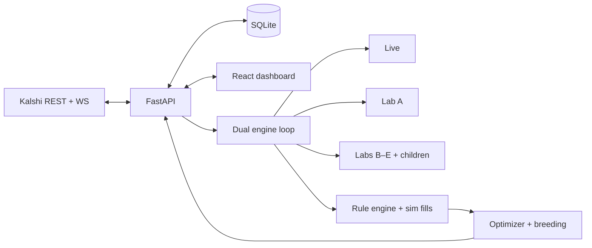

# Kalshibot (Chomp's Diner)

**Self-hosted Kalshi trading stack** — FastAPI backend + React (Vite) dashboard. Runs on your machine: REST/WebSocket market data, a JSON rule engine, parallel **paper + live** branches, SQLite history, and an optional **optimizer** with explainable **Labs Breeding** and a **Breeding Council** Think Tank (Labs B–E).

| | |
|---|---|
| **Version** | [`v0.4.15.010`](VERSION) — see [`CHANGELOG.md`](CHANGELOG.md) |
| **Branches** | `develop` (day-to-day) · `main` (release-aligned) |
| **Data** | `data/bot.sqlite3` (+ optional JSONL under `data/logs/`) |

---

## Why use it

- **One dashboard** for Live + **Lab A** (staging / optimizer target) + **Labs B–E** (breeder reference arms) + **child** `lab_child_*` slots — performance, equity, holdings, signals, optimizer radar.
- **Rules stay yours** — JSON config + per-lab overrides; optimizer may propose changes; promotion toward Live is deliberate.
- **Observable** — structured logs, `/api/health`, equity snapshots, trade/signal trails.
- **No hosted middleman** — API keys and DB never leave the host you run.

---

## Architecture (at a glance)



- **`dual_engine_loop`** ticks **Live**, **Lab A–E**, and **child** branches (staggered to reduce public API burst).
- **`lab_communication`** powers the **Think Tank** transcript (`GET /labs/chat`) — short breeder dialogue; separate from GA breeding in `lab_breeding.py`.
- **Breeding / family tree** — tournament-style parents, synergy metadata, UI tree under Optimizer (see [`.cursor/rules/architecture-breeding.md`](.cursor/rules/architecture-breeding.md)).

---

## Branch cheat sheet

| Branch | Role |
|--------|------|
| **live** | Production path: paper sim or real Kalshi orders from config. |
| **lab_a** | Staging / blend; optimizer **may** target Lab A before you promote ideas to Live. |
| **lab_b** | Conservative breeder reference. |
| **lab_c** | Aggressive breeder reference. |
| **lab_d** | High-variance reference. |
| **lab_e** | Balanced / adaptive fourth breeder (Breeding Council). |
| **lab_child_*** | Ephemeral GA children (invisible engines by default pattern). |

---

## Quick start — local development (Windows)

PowerShell from the repo root:

1. **Python env**

   ```powershell
   .\scripts\create_venv.ps1
   ```

2. **Environment** — copy [`.env.example`](.env.example) to `.env`, set Kalshi credentials and any ports (see comments in the file).

3. **Launch API + Vite** (typical dev stack)

   ```powershell
   .\scripts\launch_local.ps1
   ```

4. **Open the UI** — default Vite dev port for this worktree is **`http://127.0.0.1:5174`** (API often **`8765`**; see script output).

macOS/Linux: use the same env file and run the backend module / Vite commands your team uses, or adapt `launch_local.ps1` patterns.

---

## Quick start — packaged API (Windows)

- Build or download the API executable from **Releases** (when published).
- Run `kalshibot-api.exe` (or your build output); set `KALSHI_BOT_PORT` if you need a non-default port.
- Serve the built UI from `frontend/dist` with any static host, or open the dev URL you proxy to the API.

---

## Configuration

- **Runtime config** is stored in SQLite (`bot_config` / merged payloads) and edited from **Settings** in the UI (`PUT`/`POST` under `/api/config` and lab-branch routes).
- **Environment** (ports, Kalshi base URL, log level, HTTP/WS tuning) lives in **`.env`** — see [`.env.example`](.env.example) and [`backend/app/settings_env.py`](backend/app/settings_env.py).
- **Backups** — copy `data/bot.sqlite3` regularly; use Settings reset flows carefully in production.

---

## API highlights

| Area | Examples |
|------|-----------|
| Dashboard | `GET /api/dashboard`, `GET /api/dashboard/equity` |
| Health | `GET /api/health` |
| Trades / signals | `GET /api/trades`, signals routes as exposed in `main.py` |
| Optimizer | `GET /api/optimizer/status`, breeding tree payloads from optimizer routes |
| Think Tank | `GET /labs/chat` (rolling breeder lines; optional `reply_to` on rows) |
| Config | `GET/PUT /api/config`, lab branch patches |

Explore the live OpenAPI docs at **`/docs`** while the server is running.

---

## Frontend (dashboard)

- **Vite + React + TypeScript** in [`frontend/`](frontend/).
- **Build:** `cd frontend && npm ci && npm run build` → static assets in `frontend/dist/`.
- **Dev:** `npm run dev` (CORS origins must include your Vite origin; see bootstrap scripts).

Notable UI areas: branch performance tabs, **six** equity small-multiples (Live + A–E), hero branch strip, Optimizer + **Lab Think Tank**, Settings (engines per lab, optimizer, resets).

---

## Backend (engine + API)

- **FastAPI** app in [`backend/app/`](backend/app/).
- **Engines** under [`backend/app/engines/`](backend/app/engines/) — `tick_once`, dual loop, sim settlement, equity snapshots.
- **Persistence** — [`backend/app/persistence.py`](backend/app/persistence.py) (defaults, migrations, store).

Run tests from repo root (with venv active):

```powershell
pytest -q
```

---

## Security & operations

- **Treat the host as the trust boundary** — no built-in multi-user auth; use firewall/VPN where needed.
- **Keys** — only in `.env` / local secrets; never commit real credentials.
- **Logs** — JSON logging optional for production aggregators (`LOG_JSON=1`).

---

## Contributing

1. Branch from **`develop`**, open PRs against **`develop`**.
2. Keep changes focused; match existing style (Ruff/formatters if configured).
3. Update [`CHANGELOG.md`](CHANGELOG.md) and [`VERSION`](VERSION) when shipping user-visible behavior.

---

## More reading

| Doc | Purpose |
|-----|---------|
| [`CHANGELOG.md`](CHANGELOG.md) | Release notes |
| [`README-short.md`](README-short.md) | Ultra-compact pitch |
| [`.cursor/rules/architecture-breeding.md`](.cursor/rules/architecture-breeding.md) | Breeding vs dashboard engine concepts |
| [`docs/startup_performance.md`](docs/startup_performance.md) | Startup / cache tuning notes |

---

*Kalshibot is independent software, not affiliated with Kalshi. Trading involves risk; paper modes exist to experiment without live orders.*
