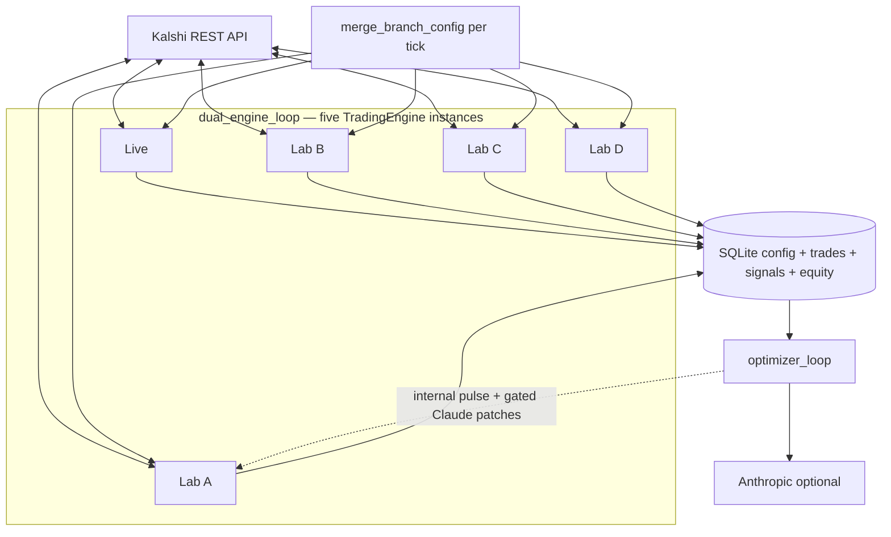
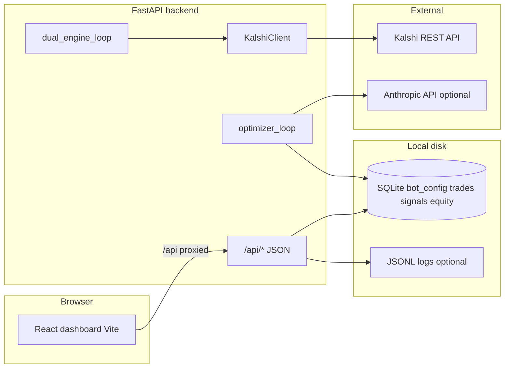

# Kalshibot

> **What this is (one sentence):** a **self-hosted** Kalshi trading stack—**FastAPI** + **React**—that polls markets, matches **JSON probability/time rules**, records fills in **SQLite**, and runs **Live** and **four paper labs** in parallel, with an optional **optimizer loop** (internal tuning plus optional **Claude**) that reads all labs but only **auto-persists** sizing-style changes for **Lab A** under guardrails.

It connects to [Kalshi's API](https://docs.kalshi.com/getting_started/api_keys), runs **rule-based engines** per branch, and ships a **Vite** dashboard for config, charts, and health—**no separate hosted control plane**; your keys and data stay on the machine you run it on.

**Runbooks:** [Quick start (Windows)](#quick-start-windows) · [macOS / Linux](#macos-and-linux-manual) · [Configuration](#configuration) · [API overview](#api-overview) · [Dashboard (UI map)](#dashboard-ui-map) · [Optimizer visualizations](#optimizer-visualizations) · [Developer notes](#developer-notes)

**Default workflow:** work on the **`develop`** branch for changes, then merge to **`main`** for release; both should track `origin` the same way if you use a two-branch flow. The UI is a single **Vite** SPA: hot reload in dev, **`npm run build`** for `frontend/dist/`; the API is stateful (SQLite, engine loops) so always restart uvicorn when changing **Python** engine or persistence code.

**Security reminder:** the stack is **intended to run on your own host** (localhost or a private server). The FastAPI app has no built-in multi-user auth—anyone who can reach the API port can change config if you bind beyond loopback. Use a firewall, VPN, or reverse auth if you expose it.

---

## Patient stop-loss (loss-recoup exit)

**Patient stop-loss** is a **paper** (simulated) safety valve that can automatically close a losing open position after a **minimum hold** and when **fee-aware unrealized P&L%** (mark-to-exit after modeled sell fees vs total cash debited at entry) is at or below a **negative threshold**. It is designed to cut depth-of-loss without reacting to the first wiggle: you set **on/off**, **min_hold_minutes_before_stop**, and **stop_loss_trigger_pct** in **Settings** (and per **lab** overlay where applicable). Live in **non-paper** (real) mode does not run this path; Labs are always sim.

| Lab / branch | Role (A/B testing) | Typical patient stop defaults (illustrative) |
|-------------|--------------------|-----------------------------------------------|
| **Live** | Production account; paper when `live_paper_trading` / `simulate` is on | Tuned in Settings; conservative vs labs depends on your saved JSON |
| **Lab A** | Primary experiment; promote-to-Live and optimizer focus | Slightly **tighter** stop / shorter hold in seeded defaults (staging) |
| **Lab B** | Conservative reference arm | **Moderate** threshold & hold (reference) |
| **Lab C** | Moderate–aggressive reference | Between B and D |
| **Lab D** | Aggressive paper reference | **Wider** threshold / different hold in seeded defaults |

Exact numbers live in `default_bot_config()` and your SQLite config; the table reflects the **5-way** **Live + A + B + C + D** layout for comparing how patient exits interact with rules and fees.

---

## Recent Architectural Improvements

| Topic | What changed |
|--------|----------------|
| **Config history** | Every save appends a row to the **`config_history`** table (branch tag, timestamp, full JSON, who/why). The legacy **`bot_config`** single row remains the active config. **GET `/api/config/history`** returns the latest entries for audit; use `include_config=true` for full snapshots. |
| **Money-path tests** | `backend/tests/test_engine_money_path.py` covers non-negative sizing, patient stop gating, promotion fitness helpers, and **confirm-gated** disable of paper mode on Live. |
| **Simulate / paper flag** | Canonical key **`live_paper_trading`** (mirrors legacy **`simulate`**). Disabling paper on Live via **`PUT /api/config`** or **`POST /api/engine/toggle`** requires `confirm=YES`; attempts are logged. |
| **Dashboard API** | Heavier work is split: **`GET /api/dashboard/equity`** (frequent poll, skips slow mark refresh), plus **`/open_positions`**, **`/orderbooks`** (short TTL cache off full runs), **`/recent_trades`**. The UI polls the light equity route more often than the full **`GET /api/dashboard`**. |

---

## What it does

- **Live branch** — Uses your Kalshi account when credentials are configured. With **simulate** mode on, Live behaves as **paper** (no real orders). With simulate off and the engine on, the bot can **place real limit orders** according to your rules (you are responsible for risk and compliance).
- **Lab A through D** — Separate **simulated** branches with their own paper bankrolls, rules and sizing knobs, and metrics so you can compare strategies without touching Live.
- **Engines** — Background loops scan markets, evaluate rules, and manage positions per branch (see `backend/app/engine.py`).
- **Dashboard** — Single-page UI: branch performance, equity charts, holdings, signals and trades, Kalshi connection status, settings (rules, filters, sizing, engines, optimizer), historical export, and more. The dev server proxies `/api` to the backend. A small **optimizer health** pill (green / yellow / red from internal trace acceptance) sits in the **top bar next to the settings (⚙) control** (hover for a tooltip); it is not shown on the bottom ticker strip.
- **Persistence** — Config (active row + **`config_history`** audit table), trades, signals, and snapshots are stored under `data/` (default SQLite: `data/bot.sqlite3`). Optional **JSONL** logs for signals and trades (and optional equity logging) under `data/logs/` when enabled in `.env`.
- **Optimizer (optional)** — Scheduled or manual analysis can suggest config tweaks; optional Claude-style HTTP calls use `ANTHROPIC_API_KEY` when set (see `.env.example`). The dashboard does not ship a separate “Claude rule editor” surface—**Settings** holds serious config. The main **Optimizer** card shows a **“Optimizer Thinking (Lab A)”** radar, a **mutation** summary row, and a **lab pulse** ticker; see [Optimizer visualizations](#optimizer-visualizations) below. The radar is a **readout of internal metrics** (not a second trading engine).
- **Polling** — The UI leans on **`GET /api/dashboard/equity`** and focused routes for high-frequency updates and **`GET /api/dashboard`** for heavier “full” snapshots, so a slow home Wi‑Fi or large open-book payload does not block the whole page forever.

---

## Dashboard (UI map)

Where the main **React** surface puts things (all optional panels depending on your layout):

| Area | What you get |
|------|----------------|
| **Top bar** | Connection / engine at-a-glance, **Settings (⚙)**, **optimizer health** color pill (hovers explain acceptance band), toasts. |
| **Branch strip / hero** | Per-branch (Live + A–D) PnL and key metrics; clicking usually ties into compare / filters. |
| **Compare (equity) region** | Multi-line equity / blended or potential view; overplot toggles, granularity tabs; many charts are **double‑click to expand** in a lightbox (Esc to close), matching the pattern used on the **optimizer** radar. |
| **Branch brain (optimizer block)** | **Optimizer Thinking** radar (double‑click to expand), **mutation** row (tier, effective scale, 0–1 dial bar) directly under the chart, then **lab pulse** ticker. Full run metrics, trace, and equity sparklines are in the **report** overlay—not duplicate tiles on the card. Promote **Lab A → Live** and dangerous toggles still require confirms documented in the UI. |
| **Settings overlay** | Full **JSON** config editor, per-lab overlays, rules, fees, **patient** stop, optimizer tuning—this is the authoritative place for `PUT /api/config` and lab parity with `merge_branch_config`. |

**Resize / mobile:** the compare row and optimizer column use **flex** (`row` on wide, **stack** on small screens); if something looks “missing,” zoom out or widen—the layout does not hard-require two monitors, but the dense dashboard targets **~1280px** width for the full two-column branch experience.

---

## Optimizer visualizations

The **Optimizer** column is **read-only telemetry** for the internal and optional external optimizer. Nothing on this card places orders; engines still run from **Settings** and the dual-engine loop.

### What you see on the card

| Element | What it means |
|--------|----------------|
| **Title row** | **force** — runs an internal mutation path immediately (`POST /api/optimizer/force-internal-mutation`), gated by the same fitness/stat checks as scheduled runs. **report** — opens a full **Optimizer report** overlay (run metrics, acceptance, schedule, change history, pulse log, and richer tables than the main card). **Info** — in-page explainer for the column. |
| **Health dot** (red / yellow / green) | **Internal-mutation acceptance rate** over recent trace rows: **>60%** green, **30–60%** yellow, **&lt;30%** red. The same field drives long-form `optimizer_suggested_action` toasts (throttled), not a duplicate of the dot. |
| **Optimizer Thinking (radar)** | A **Recharts** spider / radar: **six** axes, each **0–100** after server-side normalization so you can compare branches on one scale. Typical spokes: **fitness** (composite replay score), **acceptance** (mutant acceptance %), **mutation** (dial and tier rolled into one view), **stop‑loss safety** (replay stop burden), **equity momentum** (Lab A $/h slope from snapshots), and **streak (inverted)** so **higher = better** (low red-stress). Colored **bands** = **Live + Lab A–D**; **Lab A** is the primary “staging” readout. **Double-click** the chart to open a large modal with a tabular **detail** block and the same series—**Esc** closes. If a branch is cold or lacks data, a spoke can sit in the **mid-50s** or look flat until fresh settles and snapshots exist. |
| **Mutation row** (under the radar) | A compact **tier** label (**Light** / **Medium** / **Strong** — driven by the same acceptance bands as health), the **effective mutation scale** (0–1 internal blend of tier and `mutation_aggressiveness`), and a **horizontal “Dial (0–1)”** bar showing persisted **`mutation_aggressiveness`**. This replaces the old single-line “key internal metrics…” caption: it is the at-a-glance **exploration pressure** readout. |
| **Lab pulse** | A scrolling line of short **engine / optimizer** hints (e.g. open sim, return vs basis, last optimizer note). Sourced from dashboard `lab_thoughts` / `optimizer_activity` slices—useful for “what happened last tick” without opening Settings. |

### How it connects to the backend

- The radar and health dot are built from **`GET /api/dashboard`** (and related) metrics: `cfg.optimizer` (acceptance, best fitness, red streak, effective scale, `mutation_tier`, etc.) plus branch rollups. The exact spoke formulas live in the **dashboard builder** in `backend/app/main.py` and the **React** bundle in `App.tsx` (`optimizerThinkingRadarBundle` and friends)—they are **heuristic**, not raw exchange PnL.
- **Intraday equity movement** and **book vs MTM** on the main **Equity curves** block are **separate** from the optimizer card: the optimizer radar does not replace the equity small-multiples; use both together.
- If **`optimizer.enabled`** is false and no internal pulses have run, spokes may look **neutral**; enable the scheduler in **Settings → Optimizer** and let **Lab A** accumulate **sim** settles so fitness and acceptance have signal.

For **internal pulse vs optional Claude** and what can auto-persist, see [Optimizer: internal pulse vs Claude](#optimizer-internal-pulse-vs-claude).

---

## Branches and optimizer loop (mental model)

Five engines share the same Kalshi feed but **separate ledgers**. The optimizer task reads **settled** activity across labs; **Claude** is optional and **writes through** the same guarded paths as the internal pulse (Lab A–centric).



- **Live** — Real limits when `simulate` is off and keys are valid; otherwise paper-like behavior per config.
- **Labs B/C/D** — Reference arms for compare and optimizer context; **no** automatic "copy B into Live" from Claude output.
- **Lab A** — Primary experiment branch: promote-to-Live copies **overlays** from Lab A when settled PnL gates pass; optimizer persistence is also **Lab A–biased** by design.

---

## Architecture (high level)



- **Active config** is one merged JSON row in **`bot_config`**, with **append-only** **`config_history`** for audit. Engines read through `merge_branch_config` so each branch sees **global defaults** plus **lab overlays** where set.
- **Five trading engines** share one event loop task group pattern (`dual_engine_loop`): Live plus Lab A through D, each with its own `TradingEngine` instance.

---

## Configuration layers

Understanding this removes a lot of “why did my lab pick up X?” confusion:

| Layer | Where it lives | Used by |
|--------|----------------|---------|
| **Top-level config** | Keys on the root JSON (same document as labs) | **Live** branch: `live_paper_trading` (canonical; mirrored to `simulate`), `engine_running`, `rules`, `assets`, global paper balance when not overridden, filters, **patient stop-loss** fields, fees, etc. |
| **Per-lab overlays** | `lab_a` … `lab_d` objects | When a lab’s `engine_running` is true, `merge_branch_config` builds effective config by copying globals, then for each key in `LAB_BRANCH_OVERLAY_KEYS` (see `backend/app/branch_config.py`) replacing from that lab if present. Keys include `rules`, `assets`, `balance_fraction_per_window`, `window_minutes`, `poll_seconds`, subtitle filters, fee fields, `paper_balance_cents`, and more. Empty lab `assets` is ignored so you cannot accidentally scan zero markets. |
| **Optimizer blob** | `cfg["optimizer"]` | Scheduler gates, adaptive tuning state, `change_history`, Claude model id, lab style presets, etc. Does not replace the whole config; it patches **`lab_a`** (and optimizer metadata) under controlled conditions. |

API validation for many live fields lives in **`BotConfigPayload`** (`backend/app/api_models.py`). Labs use `merge_lab_branch_patch` / `expand_partial_lab_branch` for partial updates.

**Rules validation** — `PUT /api/config` already validates `rules` through Pydantic when you send that field. **`PUT /api/config/lab-branches`** now runs the same **`RuleCfg`** checks on any embedded `rules` array before expand/save, so bad lab rules cannot bypass the API. The Settings **Advanced** rules editor includes **Validate on server**, which calls **`POST /api/config/validate-rules`** with `{ "rules": [...] }` and returns normalized JSON without persisting.

---

## Health, alerts, and Docker

| Endpoint / artifact | Purpose |
|---------------------|---------|
| **`GET /api/health`** | `status`, `started_at`, whether the dual-engine and optimizer asyncio tasks are still running. |
| **`GET /api/health/deep`** | Read-only extras: resolved SQLite path and file size, non-empty `engine_last_errors` per branch, and whether **`ALERT_WEBHOOK_URL`** is set. No Kalshi I/O. |
| **`POST /api/config/validate-rules`** | Body `{ "rules": [ ... ] }` — returns `{ ok, count, rules }` or **400** with a clear message. |
| **`ALERT_WEBHOOK_URL`** | When a branch gets a **new or changed** `last_error`, the engine loop POSTs a short JSON payload (Discord: `content`; Slack `hooks.slack.com`: `text`). Throttled by **`ALERT_WEBHOOK_MIN_SECONDS`** (default 120) per branch and error prefix. |
| **`Dockerfile`** | Minimal **Python 3.12** image running uvicorn on `0.0.0.0:${KALSHI_BOT_PORT}`. Mount a volume for `data/` if you keep the default SQLite path under the repo. |

**Kalshi 429 backoff** — `backend/app/kalshi_client.py` sleeps using **`Retry-After`**, then common reset headers such as **`X-RateLimit-Reset`** / **`RateLimit-Reset`**, then exponential backoff with jitter.

---

## Promoting Lab A to Live

The dashboard calls **`POST /api/config/promote-lab-a-to-live`** with JSON `{"confirm": true}` (and in **real-money** mode, `{"confirm": true, "ack_live": "APPLY_LIVE"}` after the user types the token).

**Behavior:**

1. Unless `skip_pnl_gate` is true, the API requires **Lab A settled PnL (cents)** to be **strictly greater** than Lab B, Lab C, and Lab D (each from simulate trade rollups). This matches the product gate in the UI.
2. For each key in **`LAB_BRANCH_OVERLAY_KEYS`**, if `lab_a` has that key set (and it is not an empty `assets` dict), the value is **deep-copied onto the top-level config**. So Live inherits Lab A’s rules, sizing, filters, assets, fee settings, etc., for those fields only.
3. **`simulate`** and **`engine_running`** are not special-cased in that loop: only keys present on `lab_a` are copied. The UI still warns before real-money promote.

After promotion, **save** returns the full updated config from SQLite.

---

## Example rules, matching, and edge

Rules are JSON objects stored in the `rules` array (live or per-lab overlay). Defaults are seeded in **`default_bot_config()`** in `backend/app/persistence.py`. Each rule is validated as **`RuleCfg`** in `api_models.py`.

### Example JSON

**YES band** (buy YES when implied YES probability falls in the band and minutes-to-expiry in range):

```json
{
  "name": "Mid 55-72%",
  "min_prob": 0.55,
  "max_prob": 0.72,
  "min_minutes_left": 4.0,
  "max_minutes_left": 18.0
}
```

**NO band** (`side: "no"` — band is on **implied NO** (= 1 − YES mid); execution uses the NO book per `pick_trade_rule` / NO ask helpers):

```json
{
  "name": "NO conviction 62-78%",
  "side": "no",
  "min_prob": 0.62,
  "max_prob": 0.78,
  "min_minutes_left": 3.0,
  "max_minutes_left": 18.0
}
```

Other top-level knobs interact with rules (for example `no_bet_when_yes_below_pct`, `exclude_yes_subtitle_contains`, sim-only `dev_sim_yes_implied_ge_pct`, `swing_exit_implied_drop_pct`). See OpenAPI on **`PUT /api/config`** for bounds and null semantics.

### How matching works (probability × time)

Implementation: **`rule_matches`** / **`pick_trade_rule`** in `backend/app/engine.py`.

1. From the order book, the engine derives an **implied YES mid** (and an **effective NO ask** when NO-side trades are possible).
2. For each rule, the **probability axis** is either implied YES or implied NO, depending on `side` (`rule_axis_probability`).
3. A rule **matches** only if **both** are true (inclusive bounds):
   - **Band:** `min_prob` ≤ axis ≤ `max_prob`
   - **Clock:** `min_minutes_left` ≤ minutes to expiry ≤ `max_minutes_left`
4. When implied YES is below `no_bet_when_yes_below_pct` (if set), **only NO-side rules** are considered for that market; otherwise YES rules are scanned first, then NO rules.

Gaps between bands are intentional "no trade" zones unless you add or widen a rule.

### How **edge** is used when several markets match

When multiple markets match a rule and have a tradable book, the sim ranking key prefers larger **edge** (then more minutes to close). From **`_market_sim_trade_rank`** in `engine.py`:

- **YES leg:** `edge = implied_yes_mid − yes_ask` (paying up to the ask vs fair mid).
- **NO leg:** `edge = implied_no_mid − no_ask` (same idea on the NO side).

So "edge" here is a simple **mid minus limit** surplus in probability units before fees—not a separate ML score. Ties and guardrails (open per ticker, budget window, etc.) are enforced later in the engine and SQLite helpers.

---

## Optimizer: internal pulse vs Claude

Code path: **`run_optimizer_once`** in `backend/app/optimizer_claude.py`. **UI note:** optimizer controls in the dashboard stay intentionally small; anything that brought **Claude-driven rule mutation** back would belong in **Settings** next to the rest of the serious config, not scattered in ad-hoc panels. The **header** (beside **⚙ Settings**) shows a color pill for **optimizer health** (acceptance-rate bands); details and the full trace live under **Settings → Lab & optimizer** and on the main **Optimizer** card.

1. **Internal pulse (always when adaptive / scheduler conditions allow)** — Does **not** require `ANTHROPIC_API_KEY`. It can adjust things like **loss-streak thresholds**, **win-path easing**, and **Lab A `balance_fraction_per_window`** (“bet pulse”) based on settled trades and gates (`min_trades_for_optimize`, `min_profitable_trades`, etc.). Changes append to `optimizer.change_history` and update pulse trace fields.

2. **Claude path** — Runs only when **`optimizer.enabled`** is true **and** `ANTHROPIC_API_KEY` is set. The service loads recent **simulate** trades and signals for **all four labs**, plus equity samples, builds a JSON payload, and POSTs to Anthropic Messages API. The model returns JSON with `recommendations` and `trend_notes`.

3. **What Claude is allowed to persist** — `_apply_claude_bet_recommendations` applies **`balance_fraction_per_window` only for `target: "lab_a"`** after min settled / profitable trade gates pass. Lab B/C/D are **reference arms** in the prompt; threshold or rule rewrites for them are not auto-applied from Claude output.

4. **Recommendations row** — Each run can insert a row into **`optimizer_recommendations`** (SQLite) for audit and the dashboard.

If the scheduler is off and there is no API key, the optimizer still records **internal-only** pulses when adaptive tuning fires.

---

## Health and metrics

**`GET /api/health`** returns JSON suitable for load balancers and simple uptime checks:

- `status` — `"ok"` when the process is serving.
- `started_at` — UTC ISO timestamp when the app lifespan started (after restart).
- `dual_engine_loop_running` — whether the background dual-engine asyncio task is still running.
- `optimizer_loop_running` — whether the optimizer loop task is still running.

Heavier metrics (DB size, last Kalshi error, equity) live in **`GET /api/dashboard`**, **`GET /api/dashboard/equity`**, and related split routes; keep `/api/health` cheap.

---

## Windows packaging

For day-to-day development, use **`scripts/*.ps1`** as documented above.

There is also a **PyInstaller** spec at the repo root (**`kalshibot-api.spec`**) and helper **`scripts/exe_api_entry.py`** for building a **standalone Windows API executable** (bundled Python, no global interpreter). Typical flow: install PyInstaller in the venv, run `pyinstaller kalshibot-api.spec`, ship the `dist` output together with `.env` and a `data/` folder. The full UI still expects **Vite** or a static hosting story unless you add a static mount to FastAPI.

For cross-platform deploy, use the repo **`Dockerfile`** (API-only uvicorn) and mount a volume for `data/`; add nginx or Caddy in front of **`frontend/dist`** if you want a single host for UI + API.

---

## Roadmap and ideas

Constructive extensions that fit this codebase:

| Idea | Notes |
|------|--------|
| **Convergence Engine** | **Not integrated today**—stability, correctness, and dashboard UX were prioritized first. When/if an external convergence or research loop lands, it should feed the same **SQLite + guarded config** paths as the existing optimizer rather than a parallel mutation channel. |
| **Webhooks** | Baseline: `ALERT_WEBHOOK_URL` for engine errors (see Health section). Richer POSTs (drawdown, settle bursts) could when `last_error` changes or drawdown exceeds a threshold (would read from engine state or dashboard builder). |
| **Richer health** | `GET /api/health/deep` already covers lightweight DB / error introspection; extend if you need more without full `/api/dashboard` cost. |
| **Config UX** | More guided panels for rules and lab diff vs live; today much of the power is in JSON / Settings overlay. |
| **Stricter settings** | Expand Pydantic coverage for nested `optimizer` and lab dicts beyond `BotConfigPayload` merge paths. |
| **Tests** | Add unit tests around rule matching, sizing, and sim guards in `engine.py` (see existing `backend/tests/`). |
| **Kalshi rate limits** | `kalshi_client.py` already honors **`Retry-After`** on **429** with exponential backoff; if Kalshi adds consistent rate-limit headers, thread them into the same helper. |
| **Docker / static UI** | `Dockerfile` is API-only today; add nginx sidecar or Caddy for static `frontend/dist` when you want one URL for operators. |

---

## Requirements

| Component | Notes |
|-----------|--------|
| **OS** | Developed for **Windows** (PowerShell scripts). The same code runs on macOS or Linux if you invoke Python and npm manually. |
| **Python** | **3.11, 3.12, or 3.13** recommended. **3.14** often forces a `pydantic-core` source build (needs Rust or MSVC on Windows); the venv script warns about this. |
| **Node.js** | **18+** (for Vite 5 and the React app). |
| **Kalshi** | Optional for UI-only exploration; for real data and trading you need API access and keys from Kalshi (demo vs prod base URL is configured in `.env`). |
| **SQLite** | The default store is a single file (`data/bot.sqlite3` or `SQLITE_PATH`); you can open it with **DB Browser for SQLite** for read-only forensics, but do not lock the file while the API is writing. |
| **Git** | Used for source control only; the running bot does not need git on the server if you deploy from CI artifacts. |

**Performance hint:** a low-power NAS or $5 VPS is fine for **read-only** monitoring, but the **engines + optimizer** benefit from a steady **CPU** core and local disk (avoid network-attached `SQLITE_PATH` on Wi‑Fi for production).

---

## Glossary (quick)

Terms that appear in the **dashboard** and in backend logs, without re-explaining the whole `engine.py`:

| Term | Meaning in this project |
|------|-------------------------|
| **Book (return)** | Equity / PnL measured from the **ledger** and settled states—what your account *knows* it holds. |
| **MTM (return)** | Mark-to-market: unrealized marks blended with the book; **Mtm–book** style gaps show when marks diverge from the ledger. |
| **Decisive** (win/loss) | A closed trade counted as a win/loss in our rolled-up %—see metrics panel for the exact field used per tile. |
| **Scratch** | A sim exit that closes without a standard settle path; tracked separately from “clean” wins/losses. |
| **Red streak** | Consecutive “bad” optimizer / acceptance cycles (internal to the **optimizer** loop); the radar **inverts** it so **higher on the chart = better** (less stress). |
| **Balance fraction** | The fraction of a branch **paper** bankroll **per time window** used as sizing cap input (`balance_fraction_per_window`); not the only sizing knob. |
| **Promote** | Copy **allowed** `lab_a` keys onto the top-level **Live** config (with PnL and ack gates), not a Git operation. |

---

## Quick start (Windows)

From the **repository root** (the folder that contains `backend/`, `frontend/`, `scripts/`).

### 1. Create the Python virtual environment

```powershell
.\scripts\create_venv.ps1
```

Optional: pick an interpreter explicitly:

```powershell
.\scripts\create_venv.ps1 -PythonExe "C:\Path\to\Python313\python.exe"
```

This creates `.venv`, installs `requirements.txt`, and does **not** replace your global Python.

### 2. Configure environment variables

```powershell
Copy-Item .env.example .env
```

Edit **`.env`** in the repo root (see [Configuration](#configuration)). At minimum for Kalshi:

- `KALSHI_ENV` — `demo` or prod-style host per `.env.example`
- `KALSHI_API_KEY_ID` and either `KALSHI_PRIVATE_KEY_PATH` or `KALSHI_PRIVATE_KEY_PEM`

Restart the backend after changing `.env`.

### 3. Run API and dashboard together (easiest)

```powershell
.\scripts\launch_local.ps1
```

This starts **uvicorn** in a **new** PowerShell window (default **http://127.0.0.1:8765**) and **Vite** in the current window (**http://localhost:5173**). Open the **5173** URL in your browser, **not** the API port alone, so `/api` is proxied correctly.

### 4. Or run backend and frontend separately

**Terminal A — API:**

```powershell
.\scripts\run_backend.ps1
```

**Terminal B — UI:**

```powershell
cd frontend
npm install
npm run dev
```

Then open **http://localhost:5173**.

---

## macOS and Linux (manual)

There are no `scripts/*.ps1` helpers on these platforms. Use the same **Python 3.11+** and **Node 18+** as above, from the **repository root**.

### 1. Virtual environment and dependencies

```bash
cp .env.example .env
# Edit .env with your editor; set Kalshi keys when ready.

python3 -m venv .venv
source .venv/bin/activate
pip install -U pip
pip install -r requirements.txt
```

### 2. Backend (Terminal 1)

Default port **8765** (override with `export KALSHI_BOT_PORT=8080` if needed):

```bash
source .venv/bin/activate
uvicorn backend.app.main:app --reload --host 127.0.0.1 --port "${KALSHI_BOT_PORT:-8765}"
```

Run this from the repo root so the `backend` package resolves. Confirm **http://127.0.0.1:8765/api/health**.

### 3. Frontend (Terminal 2)

```bash
cd frontend
npm install
npm run dev
```

Open **http://localhost:5173**. If you changed the API port, add `frontend/.env` with `VITE_API_ORIGIN=http://127.0.0.1:YOUR_PORT` (see [Configuration](#configuration)).

---

## Configuration

All backend env vars are documented in **`.env.example`**. Highlights:

| Variable | Purpose |
|----------|---------|
| `KALSHI_ENV` | Selects demo vs production-style API host (see comments in `.env.example`). |
| `KALSHI_API_KEY_ID` / `KALSHI_PRIVATE_KEY_*` | RSA private key authentication for Kalshi. |
| `KALSHI_BOT_PORT` | API listen port (default **8765**). Use if 8765 is blocked (for example some Windows reserved ranges). |
| `SQLITE_PATH` | Override SQLite file location (default `data/bot.sqlite3`). |
| `DATA_LOG_DIR`, `DATA_LOGGING`, `DATA_LOG_EQUITY` | Append-only **JSONL** logs under `data/logs/`. |
| `DATA_RESET_TOKEN` | If set, destructive reset endpoints require matching `X-Reset-Token` header. |
| `ANTHROPIC_API_KEY` | Enables optimizer paths that call Anthropic's HTTP API. |
| `ALERT_WEBHOOK_URL` | Optional Discord or Slack incoming webhook for new/changed engine errors (see [Health, alerts, and Docker](#health-alerts-and-docker)). |
| `ALERT_WEBHOOK_MIN_SECONDS` | Minimum seconds between similar webhook posts (default **120**). |

### Bot config (SQLite JSON) — paper mode and patient stop-loss

| Key | Scope | Purpose |
|-----|--------|---------|
| `live_paper_trading` | **Live** (root) | Canonical boolean: when **true**, Live uses paper / simulated order flow. Kept in sync with legacy **`simulate`**. |
| `simulate` | **Live** (root) | Legacy mirror of `live_paper_trading` for clients and history. **Disabling** paper (switching to real limit orders) requires **`?confirm=YES`** on `PUT /api/config` or `POST /api/engine/toggle?simulate=false`. |
| `enable_patient_stop_loss` | **Live** or per **`lab_*`** | Turn patient stop-loss on or off. |
| `stop_loss_trigger_pct` | same | Fee-aware unrealized P&L% (negative) at or below which an exit is allowed after min hold. |
| `min_hold_minutes_before_stop` | same | Minimum minutes **held** before the stop can fire. |

### Frontend dev proxy

Vite proxies **`/api`** to **`http://127.0.0.1:8765`** by default (`frontend/vite.config.ts`). If you change the API port:

1. Set `KALSHI_BOT_PORT` in the root `.env` for the backend.
2. Create **`frontend/.env`** with:

   ```env
   VITE_API_ORIGIN=http://127.0.0.1:YOUR_PORT
   ```

Restart `npm run dev`.

---

## Ports and URLs

| Service | Default URL | Role |
|---------|-------------|------|
| **Dashboard (Vite)** | http://localhost:5173 | React UI; use this day-to-day. |
| **Backend (FastAPI)** | http://127.0.0.1:8765 | JSON API and `/docs` Swagger. Visiting `/` on the API port shows a short HTML hint. |

Health: **GET** http://127.0.0.1:8765/api/health and **GET** http://127.0.0.1:8765/api/health/deep — see [Health, alerts, and Docker](#health-alerts-and-docker).

---

## API overview

Interactive docs: **http://127.0.0.1:8765/docs** (when the server is running).

Representative routes:

- `GET /api/dashboard` — Full dashboard (metrics, engines, recent trades and signals, equity snapshots, order-book refresh where applicable).
- `GET /api/dashboard/equity` — Same shape as the full dashboard but **skips the slow per-position mark-refresh** pass; use for **frequent** polling. **`GET /api/dashboard/open_positions`**, **`/orderbooks`**, **`/recent_trades`** return focused slices; **`orderbooks`** may serve a **cached** payload for a few seconds.
- `GET /api/config`, `PUT /api/config` — Bot configuration (see `confirm=YES` when disabling **paper** on Live).
- `GET /api/config/history` — Last **N** **config** snapshots (default 20) from **`config_history`**.
- `GET /api/account`, `GET /api/engine/status` — Account and engine summaries.
- `POST /api/engine/toggle` — Start or stop engines / paper mode (OpenAPI: **`confirm=YES`** when `simulate=false`).
- `GET /api/trades`, `GET /api/signals` — Recent activity.
- `GET /api/history/{table}`, `GET /api/history/export.csv` — Historical tables and CSV export.
- `POST /api/data/reset` — Reset trading data (protect with `DATA_RESET_TOKEN` in production contexts).
- Optimizer: `GET /api/optimizer/recommendations`, `PUT /api/optimizer/config`, `POST /api/optimizer/run`, and related routes. Status snapshots consumed by the dashboard (mutation dial, best fitness, acceptance) come through the same **`/api/dashboard`** and dedicated optimizer endpoints—if the radar looks **flat/50s**, the API may still be warming up or a branch has no settled trades yet.
- `POST /api/config/validate-rules` — validate a `rules` array without saving.
- **`POST /api/config/promote-lab-a-to-live`** — gated PnL compare vs B/C/D, optional `ack_live=APPLY_LIVE` in real mode (see [Promoting Lab A to Live](#promoting-lab-a-to-live)).
- **OpenAPI** — `GET` parameters like `?confirm=YES` and JSON bodies for toggles are documented in **`/docs`**; when debugging 400s, read the `detail` string in the response body (FastAPI’s error shape).

**Rate and cost:** the backend batches Kalshi I/O; do not point multiple independent bots at the same API key with overlapping markets without understanding Kalshi’s rate policy—`kalshi_client` backs off on **HTTP 429** (see [Health, alerts, and Docker](#health-alerts-and-docker)).

---

## Production UI build

The dashboard is normally run through Vite in development. To produce static assets:

```powershell
cd frontend
npm install
npm run build
```

Output is under **`frontend/dist/`**. Serving that folder is **not** wired into `main.py` by default. Pick one of these patterns:

1. **Reverse proxy** (recommended) — e.g. **Caddy** or **nginx** serves `dist` on **:443** and `proxy_pass`es **`/api`**, **`/docs`**, and **`/openapi.json`** to uvicorn on **:8765** (or a unix socket). Same origin avoids CORS headaches.
2. **FastAPI `StaticFiles`** — In your fork, you can `mount("/", StaticFiles(..., html=True))` *after* registering API routes, so `/` returns `index.html`; keep a backup if you do this, because route order matters.
3. **Two hosts** — Dev-style `VITE_API_ORIGIN=https://api.example.com` in **`frontend/.env` build args** and host **`dist` on a CDN**; ensure Kalshi and session cookies (if you add any later) are compatible with your CORS list.

**Cache busting:** Vite filenames are content-hashed in **`dist/assets/`**; re-run **`npm run build`** after any UI change—operators should hard-refresh (Ctrl+F5) once after deploy.

---

## Tests (backend)

With the venv activated:

```powershell
.\.venv\Scripts\Activate.ps1
cd backend
python -m pytest
```

Install pytest first if needed: `pip install pytest`.

---

## Repository layout

- **`backend/app/`** — FastAPI app, engines, Kalshi client, persistence, optimizer.
- **`backend/app/main.py`** — App factory, CORS, lifespan, route registration.
- **`backend/app/engine.py`** — `dual_engine_loop`, `TradingEngine`, rule match / sim trade ranking, per-branch execution (large file: search `rule_matches`, `pick_trade_rule` for behavior).
- **`backend/app/branch_config.py`**, **`persistence.py`** — `merge_branch_config`, `default_bot_config`, SQLite row shapes.
- **`backend/app/optimizer_claude.py`** — `run_optimizer_once` and internal pulse; Claude gating and **Lab A–only** `balance_fraction_per_window` auto-apply.
- **`backend/tests/`** — Pytest: money-path, engine guards, API contracts where present—run with `cd backend; python -m pytest`.
- **`frontend/src/`** — React dashboard: **`App.tsx`** holds the main board, large equity/compare blocks, and optimizer **Recharts** radar; **`SettingsOverlay.tsx`** is the full-screen config editor.
- **`scripts/`** — Windows PowerShell: venv creation, run API, launch API plus UI.
- **`data/`** — Default SQLite and logs (created at runtime; may be gitignored).
- **`requirements.txt`** — Python dependencies for the API.
- **`.env.example`** — Documented environment template.
- **`kalshibot-api.spec`**, **`scripts/exe_api_entry.py`** — PyInstaller one-file API **.exe** build; UI still Vite or static-serve in production.
- **`Dockerfile`** — API-only container build (see [Health, alerts, and Docker](#health-alerts-and-docker)).

---

## Developer notes

- **TypeScript** — The frontend uses **Vite 5** + **React**; `npm run build` must be clean before you tag a release; the repo does not commit `frontend/dist/` for every change by default, so your deploy step should `npm run build` and copy **`dist/`** to your static host or add a `StaticFiles` mount in `main.py` if you self-host a single process.
- **Config shape** — When in doubt, **`GET /api/config` is truth**; `BotConfigPayload` in **`backend/app/api_models.py`** documents safe ranges. Partial lab updates go through dedicated routes; never assume the UI holds every key the server defaults.
- **Migrations** — Schema lives in `persistence` helpers; the project favors **forward-additive** SQLite `ALTER` patterns—back up `data/bot.sqlite3` before updating from a much older tag.
- **Recharts / dashboard** — Radar and line charts are standard **Recharts**; avoid adding another charting library for the same tiles unless you refactor. Accessibility: we rely on browser tooltips and ARIA for dialogs where implemented—extra props welcome in small PRs.
- **Branches in git** — **`develop` → `main`** is the typical integration path described at the top of this README; force-push to `main` only in emergencies and coordinate with anyone running forks.

---

## Scripts reference (Windows)

| Script | Purpose |
|--------|---------|
| `scripts\create_venv.ps1` | Create `.venv` and `pip install -r requirements.txt`. |
| `scripts\run_backend.ps1` | Run uvicorn with reload on `127.0.0.1` and `KALSHI_BOT_PORT` (default 8765). |
| `scripts\launch_local.ps1` | Start backend in a new window, wait for `/api/health`, then `npm run dev` in `frontend/`. |

For a frozen **Windows .exe**, see **`kalshibot-api.spec`** and **`scripts/exe_api_entry.py`**. For Linux servers without PowerShell, prefer **`Dockerfile`** or the manual uvicorn command in [macOS and Linux](#macos-and-linux-manual).

---

## Safety and responsibility

- **Real money** can be at risk when **simulate is off** on Live and the **engine posts orders**. Confirm `KALSHI_ENV`, account, and rules before enabling automation.
- Treat **`.env` and private keys** as secrets; do not commit them.
- Use **`DATA_RESET_TOKEN`** if you expose the API beyond localhost.

---

## Troubleshooting

- **Cannot reach the backend / failed fetch** — Start the API first; use **http://localhost:5173** so the Vite proxy forwards `/api` to uvicorn.
- **404 on `/api`** — You opened the wrong origin (for example only port 8765 without the Vite app). Use port **5173** for normal UI work, or call **8765** directly only for JSON and `/docs`.
- **Port 8765 in use** — Set `KALSHI_BOT_PORT` and matching `VITE_API_ORIGIN` in `frontend/.env`, then restart both processes.
- **Slow `/api/dashboard`** — The payload can be heavy (open positions, order books). The UI may show timeouts; reduce open sim positions, pause engines, or inspect backend logs. Prefer the split routes (`/dashboard/equity`, `/open_positions`, etc.) in custom scripts for automation.
- **Optimizer / radar looks wrong after restore** — If you restored a DB or reset `data/`, the optimizer and equity slopes need fresh snapshots: let engines run, confirm **`GET /api/health`** shows both loops, then recheck. Red streak and acceptance read from optimizer state, not the chart alone.
- **PyInstaller or Docker shows API only** — The Windows `.exe` and **`Dockerfile`** are **API-first**; open the Vite dev app against that API (`VITE_API_ORIGIN`) or build **`frontend/dist`** and serve with nginx—there is no embedded React in the default `Dockerfile` image.

---

## Kalshi

This project is an independent tool for the Kalshi API. **Kalshi** is a trademark of KalshiEX LLC. Follow Kalshi's terms of service and API rules when using this software.
