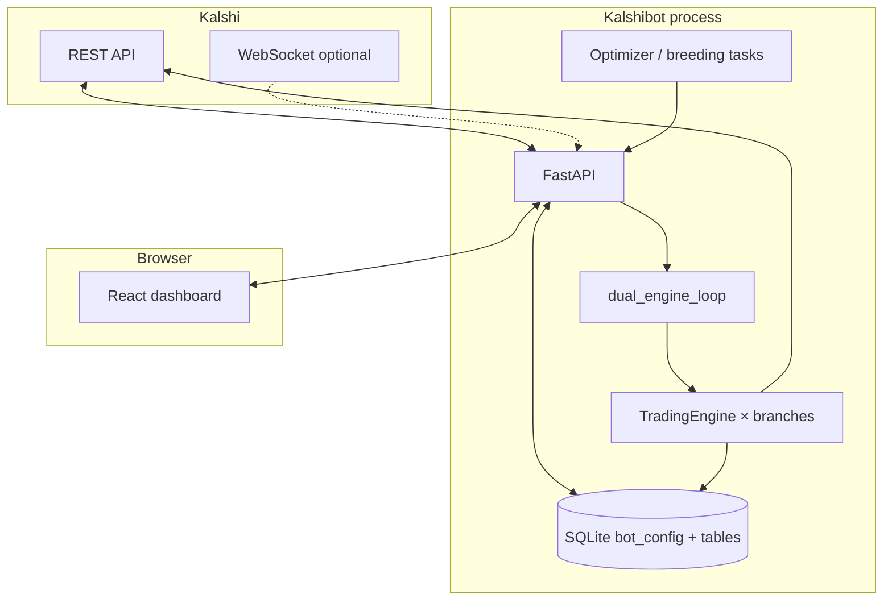

# Kalshibot (“Chomp’s Diner”)

**Self-hosted Kalshi trading stack** — a **FastAPI** backend and **React (Vite)** dashboard that run on **your** machine. One process owns Kalshi **REST** (and optional **WebSocket**) traffic, a **JSON rule engine**, **SQLite** history, and a **dual engine loop** that ticks **Live** plus **five paper labs (A–E)** and hidden **`lab_child_*`** breeding slots. An **optimizer** and **Labs Breeding** layer can propose and replay experiments; a **Breeding Council Think Tank** (Labs **B–E**) adds lightweight, in-memory “lab chat” for the UI — separate from the GA breeding code path.

| | |
|---|---|
| **Version** | [`VERSION`](VERSION) (currently **v0.4.15.011**) · full history in [`CHANGELOG.md`](CHANGELOG.md) |
| **Default branches** | **`develop`** — day-to-day work · **`main`** — release-aligned / sidecar worktrees |
| **Primary data** | `data/bot.sqlite3` · optional JSONL under `data/logs/` |
| **Stack** | Python 3.11+ · FastAPI · React 18 · TypeScript · Vite · Recharts |

---

## Table of contents

1. [Why run Kalshibot](#why-run-kalshibot)
2. [What you get out of the box](#what-you-get-out-of-the-box)
3. [Architecture](#architecture)
4. [Branch model (Live + labs)](#branch-model-live--labs)
5. [Prerequisites](#prerequisites)
6. [Quick start — Windows (recommended path)](#quick-start--windows-recommended-path)
7. [Quick start — macOS / Linux](#quick-start--macos--linux)
8. [Packaged API (Windows exe)](#packaged-api-windows-exe)
9. [Configuration: two layers](#configuration-two-layers)
10. [Dashboard & Settings map](#dashboard--settings-map)
11. [API reference](#api-reference)
12. [Development: frontend & backend](#development-frontend--backend)
13. [Testing](#testing)
14. [Troubleshooting](#troubleshooting)
15. [Security & operations](#security--operations)
16. [Repository layout](#repository-layout)
17. [Contributing](#contributing)
18. [Further reading](#further-reading)

---

## Why run Kalshibot

- **Single glass pane** — Live paper or real-money path, **Lab A** staging, **Labs B–E** as parallel paper “personalities,” and **child** engines — all in one UI: equity, MTM, signals, trades, open sims, optimizer radar, and breeder tree.
- **Rules stay on your disk** — Config is JSON merged from SQLite; per-lab overlays; **only Lab A** is on the intentional promotion path toward Live (gated, not automatic).
- **Observable by design** — Structured logging, health routes, equity snapshots, signal/trade trails, optional JSONL, OpenAPI at `/docs`.
- **No SaaS in the middle** — API keys and DB files stay on the host you control.

---

## What you get out of the box

| Area | Details |
|------|---------|
| **Engines** | `dual_engine_loop` ticks Live + Lab A–E + children with **stagger** between labs to reduce Kalshi public API burst. |
| **Paper sim** | Per-branch bankroll, fees, patient stop-loss, swing exits, windowed budget caps, one-open-per-series guards in SQLite. |
| **Optimizer** | Internal pulse / optional Claude path; breeding children and adoption flows documented under `.cursor/rules/`. |
| **Think Tank** | Ephemeral breeder dialogue via `GET /labs/chat` — **not** persisted; **DEBUG**-level structlog by default (`LAB_THINK_TANK_LOG_INFO=1` for noisy INFO). |
| **Audit** | Successful config writes append **`config_history`** (full JSON snapshots). |

---

## Architecture



**How to read this**

- **`backend/app/main.py`** — HTTP routes, dashboard assembly, engine toggle endpoints, lab-branch merge API.
- **`backend/app/engines/`** — `tick_once`, simulated order flow, equity snapshots, think-tank hooks per tick.
- **`backend/app/persistence.py`** — `Store`, defaults, `expand_partial_lab_branch`, migrations, `config_history` on save.
- **`backend/app/branch_config.py`** — Effective merged config per branch (`merge_branch_config`, engine-running coercion).
- **`backend/app/lab_breeding.py`** — Breeding GA / children (distinct from Think Tank chatter).
- **`backend/app/lab_communication.py`** — Think Tank bus + council/strategic dialogue templates.
- **`frontend/src/App.tsx`** — Dashboard shell, polling, lab toggles (persist via **`PUT /api/config/lab-branches`**).

---

## Branch model (Live + labs)

| Branch key | UI / product role |
|------------|-------------------|
| **`live`** | Your production path: **paper** or **real** Kalshi orders depending on `simulate` / `live_paper_trading`. |
| **`lab_a`** | Staging / blend; optimizer and promotion workflows focus here first. |
| **`lab_b`** | Conservative breeder reference. |
| **`lab_c`** | Aggressive breeder reference. |
| **`lab_d`** | Higher-variance reference. |
| **`lab_e`** | Balanced / adaptive fourth breeder (Breeding Council). |
| **`lab_child_*`** | Ephemeral children; engines follow breeding defaults (see architecture rule doc). |

Legacy rows may still say `sim_lab` in SQLite; the app treats that as **Lab A** for rollups and charts.

---

## Prerequisites

- **Python** 3.11+ (venv recommended; `scripts/create_venv.ps1` on Windows).
- **Node.js** 20+ (for Vite; `npm ci` / `npm run dev` / `npm run build`).
- **Kalshi** API key id + private key (PEM or path); demo vs prod controlled via env (see `.env.example`).
- **Git** (optional worktrees for `main` + `develop` side-by-side — see `scripts/bootstrap-main-worktree.ps1`).

---

## Quick start — Windows (recommended path)

From the **repo root** in **PowerShell**:

### 1. Create the virtual environment

```powershell
.\scripts\create_venv.ps1
```

### 2. Configure environment variables

```powershell
Copy-Item .env.example .env
# Edit .env: KALSHI_API_KEY_ID, KALSHI_PRIVATE_KEY_PEM or KALSHI_PRIVATE_KEY_PATH, KALSHI_ENV, ports, etc.
```

### 3. Start API + Vite together

```powershell
.\scripts\launch_local.ps1
```

**Defaults (develop worktree):**

| Service | URL / port |
|---------|------------|
| **Dashboard (Vite)** | `http://127.0.0.1:5174` |
| **API** | `http://127.0.0.1:8765` (override with `KALSHI_BOT_PORT` if needed) |

**Optional:** `.\scripts\launch_local.ps1 -SkipMainSidecar` — only this checkout’s API + UI.  
**Worktrees:** a linked **`main`** sidecar can use **API :8770** and **UI :5173** — see comments inside `launch_local.ps1`.

### 4. Open the app

Use the Vite URL above. With the API running, open **`/docs`** on the API port for interactive OpenAPI.

---

## Quick start — macOS / Linux

There is no single first-party shell script for all Unix setups; mirror the Windows flow:

1. `python3 -m venv .venv` and install backend deps the way your team does (or adapt `create_venv.ps1` logic).
2. Copy `.env.example` → `.env` and fill Kalshi credentials.
3. Run the FastAPI app (module / uvicorn command your team uses) on your chosen port.
4. `cd frontend && npm ci && npm run dev` — ensure **`CORS_ORIGINS`** in `.env` includes your Vite origin.

---

## Packaged API (Windows exe)

When you ship or download **`kalshibot-api.exe`:**

- Set **`KALSHI_BOT_PORT`** if the default port collides.
- Serve **`frontend/dist`** from any static host, or point Vite’s dev proxy at the exe’s HTTP port.
- **Rebuild the exe** after pulling changes: older builds may lack newer query parameters; the UI prefers **`PUT /api/config/lab-branches`** for lab engine toggles so **Lab E** and others stay in sync with SQLite.

---

## Configuration: two layers

### 1. SQLite runtime config (`bot_config`)

Edited from **Settings** in the UI and via **`GET/PUT /api/config`**, **`PUT /api/config/lab-branches`**, and related routes. Includes rules, sizing, per-lab overlays, optimizer JSON, engine flags, etc. Every successful save should go through **`config_history`** for rollback forensics.

### 2. `.env` (process / host)

Ports, Kalshi base URL, logging, HTTP timeouts, optional WebSocket, dashboard MTM caps, Think Tank log verbosity, optional **`KALSHI_API_BEARER_TOKEN`** for locking down `/api`. **Authoritative definitions:** [`.env.example`](.env.example) and [`backend/app/settings_env.py`](backend/app/settings_env.py).

**Selected environment variables**

| Variable | Role |
|----------|------|
| `LOG_LEVEL` | `DEBUG` \| `INFO` \| … — stdlib / structlog baseline. |
| `LOG_JSON` | `1` — one JSON object per line (containers / aggregators). |
| `LAB_THINK_TANK_LOG_INFO` | `1` — log each Think Tank bus line at **INFO** (default is **DEBUG** only). |
| `SQLITE_PATH` | SQLite file; relative paths anchor to **repo root**. |
| `DATA_LOG_DIR` | JSONL log directory. |
| `CORS_ORIGINS` | Comma-separated browser origins allowed to call the API. |
| `KALSHI_WS_ENABLED` | Optional WS for orderbooks / tickers (REST cache remains). |

---

## Dashboard & Settings map

| UI area | Purpose |
|---------|---------|
| **Hero / branch strip** | Live + Lab A–E at a glance; engine toggles; marquees. |
| **Equity** | Live + five lab small-multiples and compare overlay. |
| **Account / performance** | Holdings, metrics, and activity filtered by branch. |
| **Optimizer** | Status, radar, breeding tree, **Lab Think Tank** transcript (`/labs/chat` polling). |
| **Settings → Simulation labs** | Per-lab tabs, **Save all labs**, combined reset + sizing, **Mass apply** (batch **`PUT /api/config/lab-branches`**: engines on/off, uniform paper, copy sizing from active tab, copy patient stop from chosen source lab, auto-reset flags for checked labs). |
| **Settings → Data** | Scoped resets, optional uniform paper after wipe, backup toggles. |

---

## API reference

| Area | Endpoints (representative) |
|------|------------------------------|
| **Dashboard** | `GET /api/dashboard`, `GET /api/dashboard/equity`, `GET /api/dashboard/orderbooks`, … |
| **Health** | `GET /api/health`, deeper variants as listed in `routers/health`. |
| **Trades / signals / history** | `GET /api/trades`, `GET /api/history/{table}`, export CSV routes. |
| **Config** | `GET/PUT /api/config`, **`PUT /api/config/lab-branches`**, `POST /api/engine/toggle` (Live / simulate / legacy sim_lab), promote Lab A, data reset. |
| **Optimizer** | `GET /api/optimizer/status`, `POST` run routes as exposed in `optimizer_routes` / `main`. |
| **Think Tank** | **`GET /labs/chat`** — rolling JSON lines (`reply_to` optional). |

Full interactive schema: **`http://<api-host>:<port>/docs`** while the server is running.

---

## Development: frontend & backend

### Frontend (`frontend/`)

```powershell
cd frontend
npm ci
npm run dev
npm run build
```

- **Output:** `frontend/dist/` for static hosting.
- **Proxy:** Vite dev server proxies `/api` and `/labs` — see [`frontend/vite.config.ts`](frontend/vite.config.ts) (`VITE_API_ORIGIN`, default `http://127.0.0.1:8765`).

### Backend (`backend/app/`)

- Entry: FastAPI app in **`main.py`**; engines initialized in app lifespan.
- **Run tests** (repo root, venv active):

```powershell
pytest -q
```

---

## Testing

```powershell
pytest -q
```

Money-path, stop-loss, and breeding-sensitive tests are expected to stay green before merge; see CI or local `pytest` output for the authoritative list.

---

## Troubleshooting

| Symptom | Things to check |
|---------|------------------|
| **UI 404 on `/api`** | Use the **Vite** dev URL so `/api` is proxied, not the raw API port alone. |
| **CORS errors** | Add your Vite origin to **`CORS_ORIGINS`** in `.env`; restart API. |
| **Lab E (or any lab) won’t stay “on”** | Confirm API version; UI persists lab engines with **`PUT /api/config/lab-branches`**. In SQLite, `lab_e` migrated from missing keys may default `engine_running` false — toggle once or use **Mass apply → engines ON**. |
| **Think Tank spam in logs** | Default is **DEBUG**; unset **`LAB_THINK_TANK_LOG_INFO`** or set to `0`. |
| **Dashboard slow / MTM flat** | Fewer open sims, shorter MTM gather cap env (`DASHBOARD_FAST_MTM_GATHER_TIMEOUT_S`), or temporarily disable fast MTM (`DASHBOARD_FAST_PAPER_MTM=0`) — see `.env.example`. |
| **`database is locked`** | SQLite busy timeout is set in the store; avoid two processes writing the **same** `SQLITE_PATH` unintentionally (parallel worktrees should use **separate** `data/` paths). |

---

## Security & operations

- **Host = trust boundary** — There is no built-in multi-user auth on the API; use **firewall**, **VPN**, **`KALSHI_API_BEARER_TOKEN`**, or a reverse proxy if you expose beyond localhost.
- **Secrets** — Keep `.env` out of git; rotate Kalshi keys if leaked.
- **Live money** — Promotion and real-order paths require explicit confirmations and config gates; do not strip those checks.
- **Backups** — Copy `data/bot.sqlite3` before risky resets; JSONL under `data/logs/` is optional telemetry.
- **Production logs** — `LOG_JSON=1` helps centralized logging; tune `LOG_LEVEL` per environment.

---

## Repository layout

| Path | Contents |
|------|----------|
| `backend/app/` | FastAPI app, engines, persistence, optimizer, breeding, Kalshi client, WS. |
| `frontend/src/` | React dashboard, settings, charts, lab hive UI. |
| `scripts/` | Windows bootstrap: venv, `launch_local`, worktree helpers. |
| `data/` | Local SQLite + logs (gitignored except examples). |
| `.cursor/rules/` | Architecture and operating contract for contributors / agents. |

---

## Contributing

1. Branch from **`develop`**; open PRs against **`develop`** (or follow your team’s promotion to **`main`**).
2. Keep diffs focused; match existing patterns (types, structlog, React hooks style).
3. Ship user-visible behavior with **`CHANGELOG.md`** + **`VERSION`** bumps per project convention.

---

## Further reading

| Document | Why open it |
|----------|-------------|
| [`CHANGELOG.md`](CHANGELOG.md) | Release-by-release behavior changes. |
| [`README-short.md`](README-short.md) | Ultra-compact elevator pitch. |
| [`.cursor/rules/architecture-breeding.md`](.cursor/rules/architecture-breeding.md) | Breeding vs dashboard engines, children, adoption. |
| [`.cursor/rules/kalshibot-operating-contract.mdc`](.cursor/rules/kalshibot-operating-contract.mdc) | Non-negotiables (Lab A promotion, live money gates, patch versioning). |
| [`docs/startup_performance.md`](docs/startup_performance.md) | Cold start, cache, and dashboard latency notes. |

---

*Kalshibot is independent software, not affiliated with Kalshi. Trading involves risk; paper and simulation modes exist to experiment without live exchange orders.*
